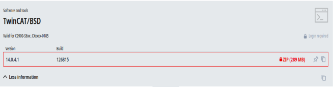

# TCBSD-in-VirtualBox
Running a virtual TwinCAT/BSD in VirtualBox

Used hardware and software:

  * HP-Z210 Workstation
  * Ubuntu 22.04.4 LTS
  * Oracle VirtualBox 6.1.50_Ubuntu r161033
  * TwinCAT 3 XAE / XAR / BSD
  * Microsoft Visual Studio 2019

Download the latest TwinCAT/BSD file from the Beckhoff site and unzip it to a folder (example):

The downloaded ISO file structure cannot be used directly for installation within VirtualBox.
The file needs to be converted to a usable vmdk format.
As VirtualBox is installed we can use the following command in a terminal session which will create a .vmdk file:

>>***VBoxManage convertfromraw --format VMDK TCBSD-x64-14-126815.iso TCBSD_Install.vmdk***

Create a new virtual machine “TCBSD” in VirtualBox:

Use the following hard disk settings:

Hard disk settings continued:

Select “Enable EFI (special OSes only)” else the machine won’t start, and add an extra network card so that we can use it at a later stage for additional network communication protocols:

Copy the earlier created “TCBSD_Install.vmdk” to the Virtual Machine directory for selection as an additional hard disk:

Change the standard IDE hard disk controller to SATA:

Add both the “TCBSD.vmdk” and “TCBSD_Install.vmdk” to the created SATA controller:

This will result in the following hard disk setup:

Now we can startup the virtual machine and “Woohoo!” we get the familiar TC/BSD logo and installer menu:

We select the available harddisk for installation and then we wait untill the TC/BSD system has been installed:

After this we return to the main menu and take note of the assigned IP addresses for later configuration, after that we select “Shutdown”.
The temporary hard disk “TCBSD_Install is not needed anymore an can now be removed:

After starting the TC/BSD virtual machine we login with the Administrator account and change the em0 (first network card) with the following terminal commands.
This will be the network connection to connect from the TwinCAT XAE Shell to the TC/BSD PLC:

>>***pciconf -lv | grep -A1 -B3 network*** (show all connected network cards)

To make the persist changes across reboots execute the following command:

>>***sudo sysrc ifconfig_em0="inet 192.168.2.100 netmask 255.255.255.0"***

Add the default router executing the following command:

>>***sudo sysrc defaultrouter="192.168.2.1"***

To be able to access our virtual TC/BSD PLC within the TwinCAT XEA Shell we need to add a static route to the AMS route table. The TC/BSD PLC can be found via a “Broadcast Search”:

Now the TC/BSD PLC can be selected within the TwinCAT XEA Shell:

